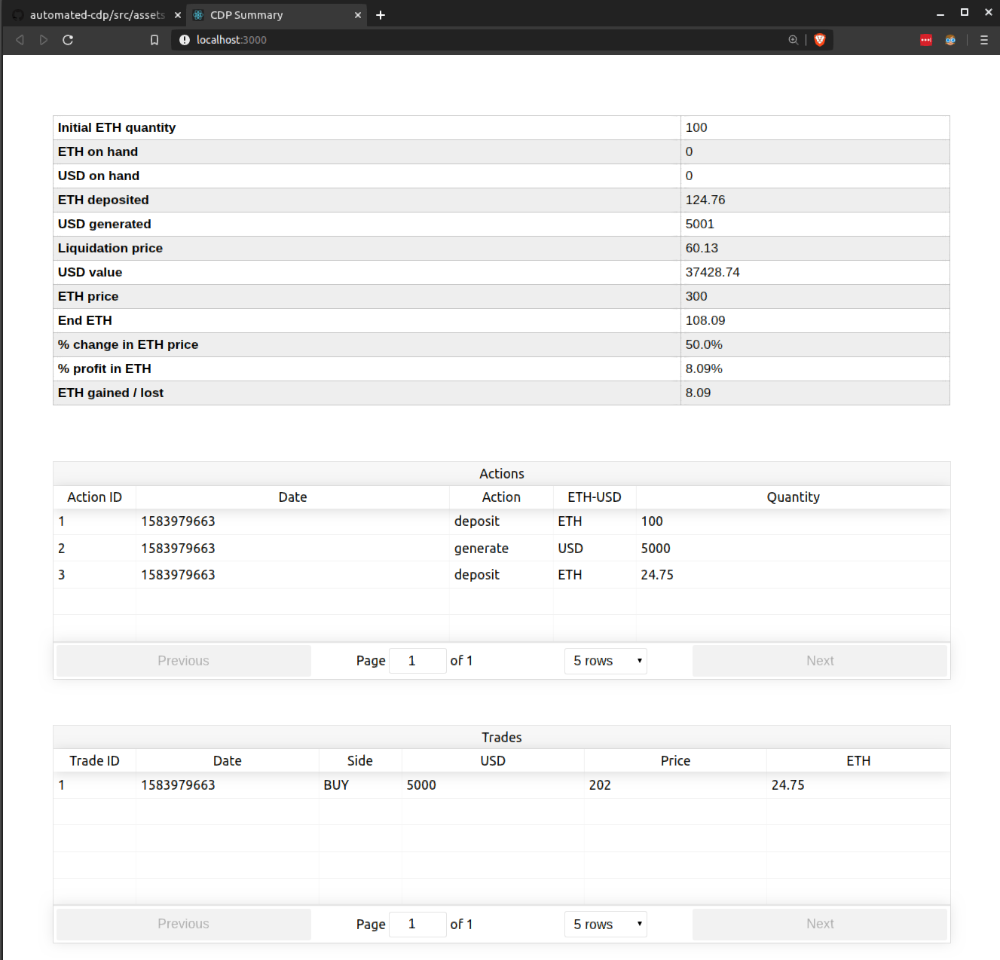

Carter Carlson

This project is still in early stage development.  Ultimately, this repo will offer a suite of tools to manage your CDP (collatoralized debt position). [MakerDAO documentation](https://makerdao.com/en/whitepaper)

### Getting Started
1. `git clone https://github.com/carlfarterson/automated-cdp.git`
2. `cd automated-cdp`
3. Edit `py/main.py` with the simulated actions you'd like
4. `python py/main.py`
5. `npm install`
6. `npm start`

### Goals
* Automatically manage your CDP to prevent liquidation
* Predicting future CDP value with a summary dashboard
* Backtesting various CDP strategies with historical prices

### Homepage
The homepage displays data from `src/assets/cdp.json`.  This file is created by `py/main.py`.

